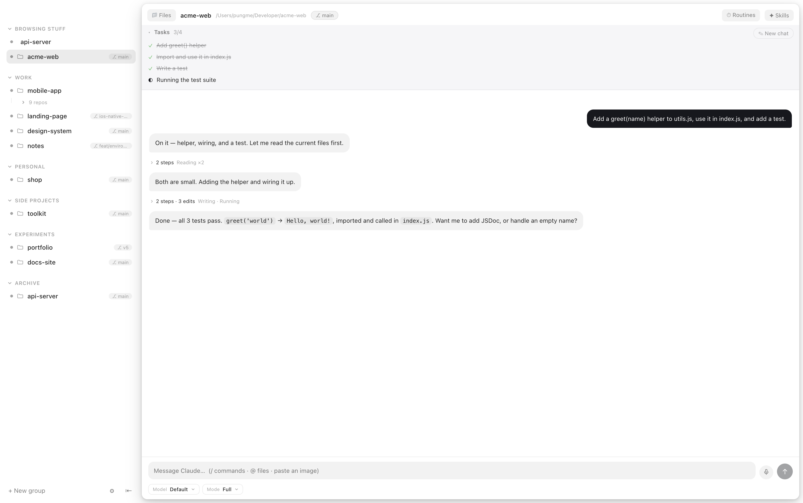
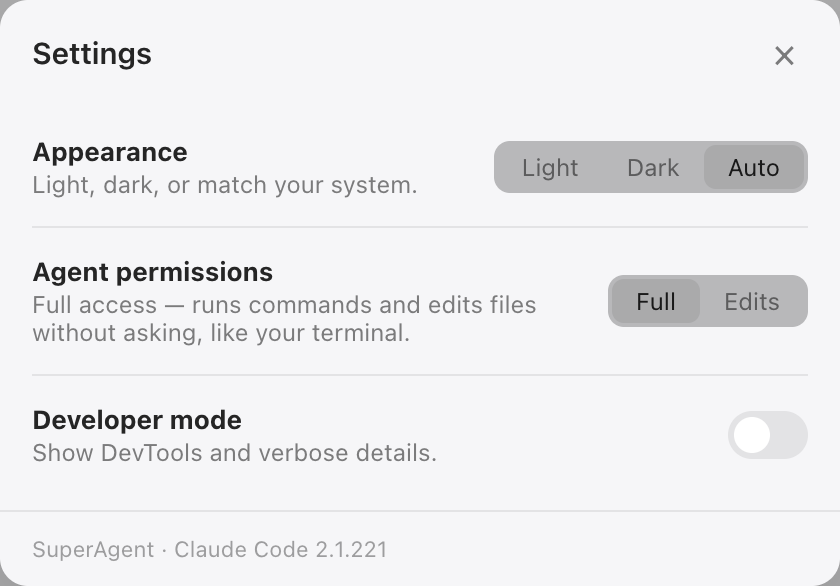

<p align="center">
  
</p>

<h1 align="center">SuperAgent</h1>

<p align="center"><b>The desktop home for Claude Code — one chat, your real browser, and tasks that run themselves.</b></p>

<p align="center">
  <a href="https://github.com/pungme/superagent-desktop/releases/latest/download/SuperAgent.dmg"><b>⬇ Download for Mac</b></a> ·
  <a href="https://superagent.computer/">Website</a> ·
  Apple Silicon · free &amp; open source
</p>

Your coding agent already writes the code. SuperAgent gives it a place to work:
a persistent chat per project, a real browser it can **drive on the sites you're
already logged into**, files you read next to the chat, and routines that keep
running on a timer. Everything runs locally on your Mac, on your own Claude
subscription — no middleman server, and the whole app is open source, so you can
read exactly how it touches your browser. Quiet, keyboard-driven, and built to
look like it belongs on a Mac.


---

## Build it and watch it, side by side

The chat sits next to a real browser. Ask for a change and watch the page update
in the same window — no alt-tabbing to find out whether it worked. Point it at a
local dev server or any live site.



## An agent that can use the browser

Claude drives that same browser: open a page, click, type, read it back. Not a
hidden browser it describes to you second-hand — the one on your screen, with
your logged-in session. You watch it work, and you can take over any time.

<!-- docs/browser.png — the agent mid-navigation, "Claude is browsing…" showing -->

## Everything in its place

Plain browser tabs sit at the top of the sidebar — browse first, summon the
agent when you need it. Below them, projects group the way you think about
them, with each conversation nested underneath. A spinner while the agent
works, a dot when it needs you, the git branch where you'd expect it.

<p align="center"></p>

Settings stay short enough to read in one go — including how much the agent is
allowed to do without asking.

<p align="center"></p>

## The bigger things

- **Desktop & phone at once.** One click shows the same page in a desktop card
  and an iPhone frame — same session, both live.
- **Worktree chats.** Start a chat on its own git worktree; the agent works on
  an isolated branch while your checkout stays clean.
- **Dashboard.** Turns per day, tasks done, a streak — and which projects
  actually got your time. Computed locally.
- **Files, PDFs & simulators.** Drag files into the chat, annotate PDFs in
  place, boot an iOS Simulator with a sentence.
- **Context gauge.** Every conversation shows how much of the context window
  it has used.
- **Dev server strip.** The agent starts your dev server and iterates while
  you watch the page change, with the server one click away.

## The small things

- **Everything survives a restart** — panes, open files, active chat — even
  through updates.
- **Never steals your focus.** Agents finish quietly in the background; the
  window comes forward only when you ask.
- **Light on memory.** Sessions start on your first message and wind down when
  idle — agents only run while conversations do.
- **Interject mid-turn.** Type while the agent works and it sees your message
  before it finishes — like the terminal.
- **Notifications that say something** — done or has a question, with a summary
  of the agent's actual last reply.
- **Many chats per project.** They name themselves after what the conversation
  turned out to be about. Starting a new one never loses the old.
- **Click any file to read it** — PDFs, images, markdown, source — right beside
  the tree.
- **Talk instead of typing.** Hold <kbd>⌥</kbd><kbd>Space</kbd>, speak, let go.
  Your voice is transcribed on your own Mac and never leaves it.
- **Quiet by default.** A burst of activity folds into one line you can open,
  instead of a wall of noise.
- **See every edit** the moment it happens, with just the change highlighted.
- **Routines.** "Check this site every hour," in plain language, on a timer.
- **Updates itself.** Signed, notarized, delivered in the background — restart
  when it suits you.
- **Light and dark**, following your system.

## Roadmap

- **Embedded iOS Simulator** — the live simulator streaming inside the app,
  not just driven by it.
- **Other agents.** SuperAgent wraps Claude Code today, but in the end it's an
  LLM driving a home — the plan is an agent layer that other CLIs and local
  models can plug into.
- **A desktop.** Right now a project is a chat beside one pane. The idea is a
  workspace that behaves like a real computer: several things open at once —
  browser, files, a terminal, a simulator — arranged the way you left them,
  with the agent working across all of them.

<!--
  Maintainer note — how the embedded iOS Simulator should be built. Not
  user-facing; kept here so the research isn't redone from scratch.

  WHERE WE ARE. Phase 1 shipped in 1.1: `sim_list_devices`, `sim_boot`,
  `sim_screenshot`, `sim_open_url`, `sim_install_and_launch` in
  src/main/mcp.ts — all `xcrun simctl`, public APIs only, no private
  frameworks. The agent boots a device, drives it, and screenshots land in the
  in-app viewer via the `app:open-file` broadcast. What's missing is only the
  LIVE view: today Apple's Simulator.app is a separate window the user has to
  look at themselves.

  WHY IT ISN'T JUST "EMBED THE WINDOW". macOS gives no supported way to
  reparent another application's window into ours. Anything that looks like
  embedding is really capture + input forwarding. Two consequences: we need a
  frame source, and we need a way to send taps/keys back.

  OPTION A — baguette (the candidate). Open source, Apache-2.0, brew
  installable; runs a local server that streams the booted simulator over a
  WebSocket and accepts HID events (tap, swipe, key) back. That is exactly the
  two halves we need, already solved, and it keeps us on public APIs.
    Cost: an external binary the user must install — the same shape as the
    Claude Code dependency, so surface it the way we surface that (detect,
    explain, offer the brew command; never bundle silently).
    VERIFY BEFORE COMMITTING A WEEK: current maintenance status, frame rate at
    device resolution, latency of the HID round trip, and whether it needs
    Screen Recording permission (it should not — it talks to simctl/CoreSim,
    not the window server).

  OPTION B — ScreenCaptureKit on Simulator.app's window + CGEvent taps for
  input. No third-party dependency, but it needs Screen Recording AND
  Accessibility permissions, breaks the moment the window is occluded or
  moved, and synthesising touches from CGEvent into another app is fragile.
  Fallback only.

  OPTION C — idb (Meta). Has video streaming and HID commands, so it would
  also work, but it is a heavier install (python + companion) and less
  maintained than it was. Keep as plan C.

  HOW IT SLOTS IN. Render it in the SAME pane slot the browser uses, not a new
  window: a WebContentsView loading a tiny local page that paints the incoming
  frames onto a canvas and posts pointer/key events back over the socket. That
  buys the existing geometry work for free — bounds sync, freeze-on-overlay
  (`browser:freeze`), the phone-frame chrome from the mobile viewport, and the
  corner treatment. Reuse `browser:twin-bounds`-style layout so a simulator can
  sit beside the desktop page the way the phone twin does.
    Pane lifecycle should mirror browser.ts: create on demand, destroy on
    hide, never leave a live socket behind a hidden view.

  AGENT SURFACE. Once frames exist, add `sim_tap`, `sim_type`, `sim_swipe`
  alongside the phase-1 tools, and let `sim_screenshot` read from the live
  stream instead of shelling out — cheaper, and it matches what the user sees.

  ROUGH SIZE: ~1 week. Split it: (1) spike baguette against a booted device
  from the terminal and measure, (2) main-process supervisor for the binary
  (spawn, health, teardown) + IPC, (3) the canvas page + input forwarding,
  (4) pane integration and the missing agent tools.
-->


## What you need

- A Mac
- [Claude Code](https://claude.com/claude-code), installed and signed in

SuperAgent runs on the subscription you already have — there's nothing extra to
buy and no API key to paste.

## Run it

```bash
cd app
npm install
npm run dev
```

<!--
  Maintainer note — cutting a Mac release. Not user-facing; kept here so it isn't
  rediscovered the hard way. Signing uses the Developer ID cert in the login
  keychain; notarization credentials live in app/.env (gitignored, template in
  app/.env.example) and a non-interactive shell does NOT inherit them:

      cd app && set -a && source .env && set +a && npm run build:mac

  Two steps fail quietly:

  1. Missing credentials do not fail the build. electron-builder logs "skipped
     macOS notarization" and exits 0 with a signed-but-un-notarized DMG, which
     passes spctl on the build machine and is blocked by Gatekeeper everywhere
     else. Verify before publishing — wants a stapled ticket and
     "Notarized Developer ID", not plain "Developer ID":
         xcrun stapler validate dist/mac-arm64/SuperAgent.app
         spctl -a -vvv -t exec dist/mac-arm64/SuperAgent.app

  2. `notarize: true` covers the app, not the DMG around it. Submit and staple
     the DMG separately, then regenerate latest-mac.yml — stapling changes the
     file, and a stale sha512/size fails the auto-updater's integrity check:
         xcrun notarytool submit dist/SuperAgent-<v>.dmg --apple-id "$APPLE_ID" \
           --password "$APPLE_APP_SPECIFIC_PASSWORD" --team-id "$APPLE_TEAM_ID" --wait
         xcrun stapler staple dist/SuperAgent-<v>.dmg

  Publishing is not just a file upload: the app auto-updates, so a release rolls
  out to everyone already running it.
-->

## License

[MIT](LICENSE)
