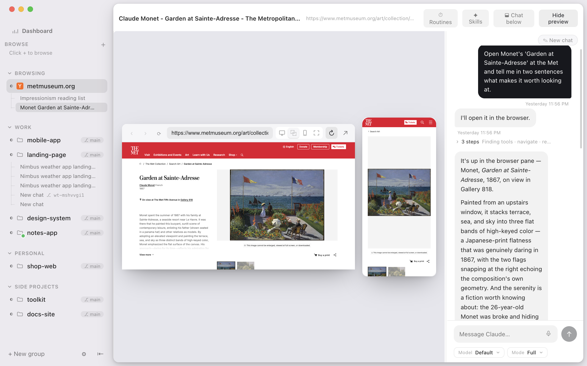

# SuperAgent

*A friendly home for Claude Code — and other coding agents.*



SuperAgent is a clean, prosumer-friendly macOS app built around AI coding agents:

- **Arc-style sidebar** — group your projects, see at a glance which agent is working, which needs you; drag its edge to resize, or hide it entirely with `⌘\`
- **Two kinds of project** — a **Code project** (point at a folder) or a folder-less **Browser project** built for web automation
- **Persistent chat** — one calm conversation per project that drives the real `claude` binary; it's saved locally and resumes with full context across restarts
- **Built-in browser** with a real omnibar (type a URL or search) — preview a local dev server, or open any real site
- **Agent-driven browsing** — Claude can open, click, type, and read **real websites** through SuperAgent's browser (via MCP), so it can watch and drive the page you see
- **Routines** — "visit this site every hour and follow 5 people" in plain language, run headless on your own Claude subscription
- **File tree & Skills panel** — browse project files and your Claude Code skills, one click away
- **Click a file to open it** — PDFs, images, HTML and text render in the pane right beside the tree; anything else opens in your default app
- **Light & dark themes** — a premium Light/Dark/Auto appearance that follows your system

### The chat

SuperAgent renders Claude Code as a polished, persistent chat while driving the real `claude` binary on your own subscription:

- **Rich markdown** with syntax-highlighted code blocks and one-click copy
- **Inline diff cards** when Claude edits a file (red/green, only the real change)
- **@-file mentions** and **/-commands** with autocomplete; click a file in the tree to open it
- **Live tool activity** — a batch of tool calls collapses to one line ("18 steps · Running ×11 · Reading ×7"); expand it for the full list
- **Saved & resumable** — the transcript is stored locally and the session is resumed (`--resume`) next launch
- **Stop** to interrupt a generation (keeps the session), **New chat** to start fresh, image paste, an auto-growing composer, and smart auto-scroll

**SuperAgent ships no AI of its own.** It's pure plumbing — chat UI, browser, scheduler. All intelligence comes from your own agent subscription (Claude Code first; Codex CLI and Gemini CLI planned).

> Early but functional. See [PLAN.md](PLAN.md) for the full roadmap.

## Develop

```bash
cd app
npm install
npm run dev
```

## Test

```bash
npm test          # unit tests (vitest)
npm run test:e2e  # end-to-end smoke tests (Playwright + Electron)
```

## Build a macOS app

```bash
npm run build       # compile main/preload/renderer
npx electron-builder --mac   # → dist/SuperAgent-<version>.dmg
```

The build is currently **unsigned / not notarized** (there's a placeholder Apple
Development signature for local runs). For public distribution you'll need an
Apple Developer account and to enable notarization in `electron-builder.yml`.

## License

[MIT](LICENSE)
