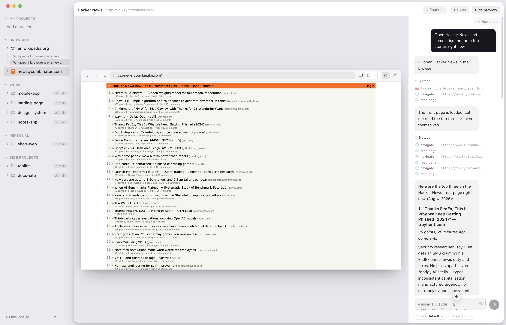
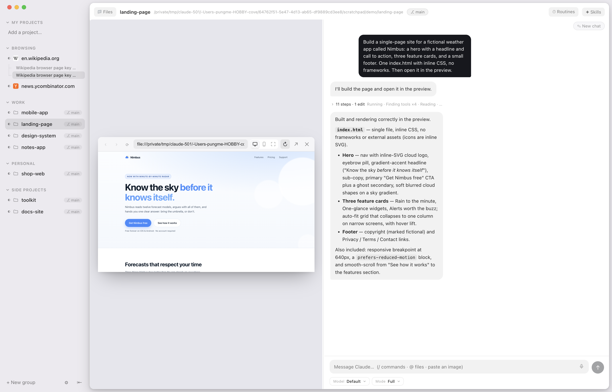
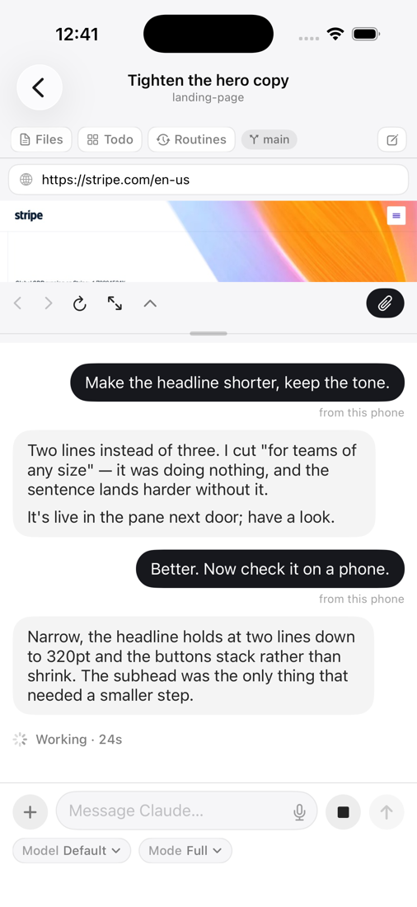

<p align="center">
  
</p>

<h1 align="center">Superagent</h1>

<p align="center"><b>A home for your agent.</b></p>

<p align="center">A Mac app where your coding agent lives: a real browser it drives, an iPhone in the window, chats that survive restarts, your phone in the loop. Open source, on the subscription you already have.</p>

<p align="center">
  <a href="https://github.com/pungme/superagent-desktop/releases/latest"></a>
  <a href="https://github.com/pungme/superagent-desktop/releases"></a>
  
  
  <a href="LICENSE"></a>
</p>

<p align="center">Works with <b>Claude Code</b> and <b>Codex</b> · switch per chat · Antigravity coming soon</p>

<p align="center">
  <a href="https://github.com/pungme/superagent-desktop/releases/latest/download/SuperAgent.dmg"><b>⬇ Download for Mac</b></a> ·
  <a href="https://superagent.computer/">Website</a> ·
  Apple Silicon · free &amp; open source
</p>

<p align="center">
  <a href="https://github.com/pungme/superagent-desktop"><b>desktop</b></a> ·
  <a href="https://github.com/pungme/superagent-ios">iOS</a> ·
  <a href="https://github.com/pungme/superagent-relay">relay</a>
</p>

Your agent already writes the code. Superagent gives it a place to work — and
gives you a place to watch. Every project is a chat sitting next to the thing
being built: a real browser on the sites you're already logged into, the files
it's editing, an iOS Simulator streamed straight into the window. Every chat
works in its own copy of the project, so nothing collides. And when you leave
the desk, the iPhone app follows the conversation and lets you answer the
agent's questions from anywhere.

Everything runs locally on your Mac, on the agent subscription you already have
— Claude Code or Codex, switchable per chat. No middleman server, no API key, no
AI of its own — and the whole app is open source, so you can read exactly how it
touches your browser.


---

## What it does

<table>
<tr>
<td width="46%" valign="top">

**Build it and watch it, side by side.** The chat sits next to a real browser.
Ask for a change and watch the page update in the same window — no alt-tabbing
to find out whether it worked. Point it at a local dev server or any live site;
the agent can start the server itself and iterate while you watch.

</td>
<td valign="top"></td>
</tr>

<tr>
<td width="46%" valign="top">

**An agent that can use the browser.** Your agent drives that same browser: open a
page, click, type, read it back. Not a hidden browser it describes to you
second-hand — the one on your screen, with your logged-in session. You watch it
work and can take over any time. Automation only ever happens in Superagent's
own pane, never in your personal browser.

</td>
<td valign="top"></td>
</tr>

<tr>
<td width="46%" valign="top">

**An iPhone in the window.** A real iOS Simulator, streamed into the app at
about a frame a second, that the agent can tap, swipe and type into. Ask it to
build and run, and it does — then looks at the screen and fixes what it sees.

</td>
<td valign="top"></td>
</tr>

<tr>
<td width="46%" valign="top">

**Your Mac's agent, in your pocket.** Pair once from Settings → Phone and the
iPhone app follows your Mac from anywhere: the conversation as it happens, a
prompt from the sofa, a yes or no when the agent asks. End-to-end encrypted,
through a relay that stores nothing and can read nothing. On iPad it takes the
Mac's shape — sidebar left, conversation right, the page beside it.

</td>
<td valign="top"></td>
</tr>

<tr>
<td width="46%" valign="top">

**Everything in its place.** The Computer sits at the top of the sidebar with
its own conversations under it. Plain browser tabs come next: browse first,
summon the agent when you need it. Below them, projects grouped the way you
think about them, each conversation nested underneath — a spinner while the
agent works, a dot when it needs you, and the git branch where you would expect
it.

</td>
<td valign="top"></td>
</tr>
</table>

### Getting the phone app

[TestFlight](https://testflight.apple.com/join/hvg9RGMh), or build it from
source — see [its README](https://github.com/pungme/superagent-ios).

- **Ask mode.** A permission mode where the agent checks with you before it
  acts — on the Mac, or on your phone if that is where you are.
- **Private by construction.** Everything between the phone and the Mac is
  end-to-end encrypted with a per-device key from the pairing QR. Both sides
  dial out to a tiny blind relay
  ([superagent-relay](https://github.com/pungme/superagent-relay)) that forwards
  ciphertext and stores nothing, so it works behind any network with no setup.
  Run your own with one command and change the URL in Settings → Phone.
- **Connects only when it is used.** The Mac opens its relay connection when a
  phone is paired or being paired. An install that never pairs a phone never
  connects anywhere.

## Also in the box

- **Every chat is its own checkout.** A new conversation gets a private copy of
  the project on its own branch, cut on its first message and named after what
  you asked for. *Keep* folds its work back in as one change; *Throw away*
  deletes it. The project row keeps a conversation that works in the folder
  itself, for when that is what you want.
- **A board the agent keeps.** Backlog, next, doing, done — per project, and
  Claude moves the cards as it works. Watch them move while you talk to it.
- **Routines.** "Check this site every hour," in plain language, on a timer.
- **Dashboard.** Turns per day, tasks done, a streak — and which projects
  actually got your time. Computed locally.
- **Files & PDFs.** Click any file to read it — PDFs, images, markdown, source —
  right beside the tree; annotate PDFs in place; drag files into the chat.
- **Snip to attach.** ✂ on the browser or the simulator (or ⌘⇧S): drag a box
  right on the page or the phone screen and the crop lands in your message, at
  full resolution.
- **`@` reaches everything.** Type `@` for this project's files, the other
  projects in your sidebar by name, or any folder on the disk (`@/`, `@~/`) —
  and drill into folders one level at a time.
- **Context gauge.** Every conversation shows how much of the context window
  it has used.

## The small things

- **Everything survives a restart** — panes, open files, active chat — even
  through updates.
- **Never steals your focus.** Agents finish quietly in the background; the
  window comes forward only when you ask.
- **Light on memory.** Sessions start on your first message and wind down when
  idle; preview panes are released when a chat is in the background.
- **Interject mid-turn.** Type while the agent works and it sees your message
  before it finishes — like the terminal.
- **Notifications that say something** — done or has a question, with a
  summary of the agent's actual last reply.
- **Many chats per project.** They name themselves after what the conversation
  turned out to be about. Starting a new one never loses the old.
- **Talk instead of typing.** Hold <kbd>⌥</kbd><kbd>Space</kbd>, speak, let go.
  Your voice is transcribed on your own Mac and never leaves it.
- **Quiet by default.** A burst of activity folds into one line you can open,
  instead of a wall of noise.
- **See every edit** the moment it happens, with just the change highlighted.
- **Model and mode pickers** that match Claude Code's own.
- **Updates itself.** Signed, notarized, delivered in the background — restart
  when it suits you, with a "What's new" for each release.
- **Light and dark**, following your system.

## What it needs — and what it talks to

- A Mac with Apple Silicon.
- [Claude Code](https://claude.com/claude-code), installed and signed in. Your
  subscription is the only thing Superagent runs on — nothing extra to buy, no
  key to paste.
- Xcode, only if you want the simulator.
- An iPhone with the companion app, only if you want your phone in the loop.

Network, in full: Claude Code's own connection to Anthropic; a check of this
repo's releases for updates; the Whisper model for push-to-talk dictation,
downloaded from Hugging Face the first time you hold the key and cached after
that (the transcription itself never leaves the Mac); and — only once you pair
a phone — one outbound connection to the companion relay (the project's by
default; swap in your own in Settings → Phone). Nothing else leaves the
machine.

## The three repositories

| | |
|---|---|
| [superagent-desktop](https://github.com/pungme/superagent-desktop) | this app — Electron, TypeScript, React |
| [superagent-ios](https://github.com/pungme/superagent-ios) | the iPhone companion — SwiftUI |
| [superagent-relay](https://github.com/pungme/superagent-relay) | the blind relay between them — a Cloudflare Worker, also runs as plain Node |

All of them in one place: [github.com/pungme?q=superagent](https://github.com/pungme?tab=repositories&q=superagent).

## Run it from source

```bash
cd app
npm install
npm run dev
```

`npm test` runs the unit tests, `npm run test:e2e` builds the app and drives it
with Playwright. Contributions welcome — see [CONTRIBUTING.md](CONTRIBUTING.md).

## Roadmap

- **Other agents.** Superagent wraps Claude Code today, but in the end it's an
  LLM driving a home — the plan is an agent layer that other CLIs and local
  models can plug into.
- **A desktop.** A workspace that behaves like a real computer: several things
  open at once — browser, files, a terminal, a simulator — arranged the way you
  left them, with the agent working across all of them.
- **Memory that writes itself.** Your agent relearns the same things in every
  new session — your conventions, a project's traps, which command actually
  deploys. Superagent should notice those and carry them across projects, in a
  list you can read, edit and delete.
- **Watchers.** Routines already run on a schedule and the browser already
  reads pages. Point one at a page and get told what changed, with a before
  and after.

## License

[MIT](LICENSE)

<!-- Maintainer notes below: not user-facing, kept so they aren't rediscovered the hard way. -->

<!--
  Maintainer note — how the embedded iOS Simulator works, and every route that
  turned out to be a dead end. Not user-facing; kept here so the research isn't
  redone from scratch.

  WHERE WE ARE. Phase 1 shipped in 1.1: `sim_list_devices`, `sim_boot`,
  `sim_screenshot`, `sim_open_url`, `sim_install_and_launch` in src/main/mcp.ts
  — all `xcrun simctl`, public APIs only. Phase 2 shipped in 1.2: the device
  streamed into the pane from its own framebuffer, via native/simfb. Two modes
  in src/renderer/src/components/SimulatorPane.tsx — "In the app" (the stream)
  and "Real device" (park Apple's window on the pane). The pane has no toolbar
  button: it reveals itself when the agent boots or launches something, the
  way the browser pane does.

  WHY IT ISN'T JUST "EMBED THE WINDOW". macOS gives no supported way to
  reparent another application's window into ours. Anything that looks like
  embedding is really capture + input forwarding.

  OPTION A — baguette (the candidate). Open source, Apache-2.0, brew
  installable; runs a local server that streams the booted simulator over a
  WebSocket and accepts HID events (tap, swipe, key) back. That is exactly the
  two halves we need, already solved, and it keeps us on public APIs.
    Cost, originally: an external binary the user had to `brew install`,
    surfaced the way the Claude Code dependency is (detect, explain, offer the
    command). NOW BUNDLED (2026-08-28, after 1.6.0): upstream publishes a prebuilt arm64
    binary per release, so app/scripts/fetch-baguette.mjs pins a version +
    sha256, drops the bare executable into app/native/, and electron-builder
    ships it in Resources next to simfb (with its Apache-2.0 LICENSE).
    Only the executable — the 38 MB resource bundle beside it is baguette's
    web UI / virtual camera, and `baguette input` acks gestures without it
    (verified 2026-08-28 on 0.1.96: tap, swipe, key, press all {"ok":true}
    from a bare binary). findBaguette() in src/main/simulator.ts tries the
    bundled copy first, then the brew paths as a fallback. To upgrade, bump
    VERSION/SHA256 in the fetch script and re-check the input payload shapes
    against `baguette input` — 0.1.88 → 0.1.96 changed nothing we send.
    VERIFIED 2026-08-08 against baguette 0.1.88 (brew). Half of it works:
      * INPUT INJECTION WORKS. `baguette tap|press|swipe|pinch|pan` drive a
        booted device and answer {"ok":true,...}. `baguette input` reads
        newline-delimited JSON gestures from stdin — exactly the shape we need.
      * FRAMEBUFFER STREAMING DID NOT PRODUCE A SINGLE FRAME. `baguette stream
        --format mjpeg` writes the multipart HTTP header to stdout
        ("HTTP/1.1 200 OK / Content-Type: multipart/x-mixed-replace") and then
        nothing — 76 bytes total, zero JPEG SOI markers. Tried: iOS 18.6 and
        iOS 26.5 runtimes; headless and with Simulator.app visible; static
        screen and with motion (openurl + home button); stdin held open; a
        {"cmd":"snapshot"} control (acknowledged on stderr as
        "control: snapshot", still no bytes); fps 5/10/15, scale 1/2.
      So the embedded live view is blocked on the frame source, not on us.
      Next moves, cheapest first: (1) read baguette's own repo/issues for a
      required flag or a known 0.1.88 regression, and try `--format h264`;
      (2) fall back to a screenshot loop — `simctl io screenshot` at 2-4 fps
      is not a live view but is honest and works today; (3) OPTION C (idb),
      which has its own video stream.

    dlopen /Library/Developer/PrivateFrameworks/CoreSimulator.framework
    dlopen <Xcode>/Contents/Developer/Library/PrivateFrameworks/SimulatorKit.framework
    SimServiceContext sharedServiceContextForDeveloperDir:error:
      -> defaultDeviceSetWithError: -> devices -> the one with state == 3
    device.io.ioPorts -> the descriptor conforming to SimDisplayIOSurfaceRenderable
      -framebufferSurface                              -> IOSurface, BGRA, native res
      -registerCallbackWithUUID:ioSurfacesChangeCallback:
      -registerCallbackWithUUID:damageRectanglesCallback:   (from SimDisplayRenderable)

    Gotchas, all hit for real:
      * Only the FIRST display port returns a surface; the other two are nil.
      * The descriptors are ROCKRemoteProxy objects. KVC throws
        (NSUnknownKeyException) — use performSelector / NSInvocation.
      * SimulatorKit.SimDisplayView is an NSView with -setDevice: and it accepts
        a SimDevice happily, but on its own it renders nothing: intrinsicContentSize
        stays 0x0 and its layer has no contents. The display port still has to be
        attached. Grabbing the IOSurface directly is the simpler path.

  WHY THE EXISTING TOOLS FAIL, and why that misled us. idb_companion 1.1.8 from
  brew reports a build date of AUG 2022 and baguette is 0.1.88; both mount a
  surface and emit zero frames on Xcode 26.5. The earlier conclusion here — that
  Apple had broken framebuffer streaming — was wrong. Simulator.app renders fine,
  so the API works; those clients simply predate the current ROCK remoting layer.
  Two old tools failing the same way is evidence they are both old, not that the
  platform is shut.

  WHAT SHIPS. native/simfb — a small compiled helper, not a Node addon, so
  there is no node-gyp and nothing to rebuild against Electron's Node ABI. It
  takes the IOSurface, encodes JPEG on the damage callback and writes frames on
  stdout (4-byte big-endian length, then the bytes). Measured in the pane: 22fps
  while scrolling, ~1fps on a still screen because a quiet screen sends no
  damage. `simctl io screenshot` survives only as the fallback.

  FALLING BACK, which matters because this is private API. main treats the
  helper as best-effort: missing binary, won't start, or started-but-never-sent-
  a-frame all drop to the screenshot mirror. That last case is what a future
  macOS moving these symbols would look like, so it is the one worth keeping.

  THINGS THAT BIT, all found by breaking it rather than reading it:
    * A shut-down device keeps its last surface, so nothing fails — the helper
      has to check the device is still booted on its heartbeat and exit.
    * When it exits, the pane needs telling (sim:gone), or it sits on a frozen
      picture for ever.
    * And "Boot it again" then has to actually restart the stream: the helper is
      gone and nothing else in the effect's inputs changes on the way back.
    * Flipping modes quickly leaked a helper per flip — start must stop whatever
      is already running for that device, of either kind.
    * build:mac did not run build:native, so a release from a clean checkout
      would have bundled a binary nothing had built.

  INPUT. baguette's gesture side works, on every runtime — CORRECTED 2026-08-08.
  This note used to claim iOS 26+ only, and the pane shipped a version gate that
  disabled tapping on anything older. Both were wrong: the original measurement
  aimed at empty space, so of course nothing changed. Re-measured against real
  controls — a Continue button on 26.5, a banner dismiss and Safari's tab button
  on 18.6 — and every tap registered, including one dispatched through the pane.
    Watch for this shape of mistake: a tap that changes nothing is not evidence
    of a broken injector. Aim at something that must react.
    idb's `hid` rpc remains an alternative (13ms warm vs baguette's 56ms) but
    there is no longer a correctness reason to take on idb_companion and a gRPC
    client for it.

  WINDOW MENU, still useful for the attach mode. Simulator's Window menu
  exposes checkbox state through AXMenuItemMarkChar (a ✓ when on, `missing
  value` when off), so "Show Device Bezels" and "Stay On Top" are readable and
  not just settable.

  AGENT SURFACE. Still to do: `sim_tap`, `sim_type`, `sim_swipe` alongside the
  phase-1 tools, so the agent drives the device the same way the user does.
-->

<!--
  Maintainer note — cutting a Mac release. Not user-facing; kept here so it isn't
  rediscovered the hard way. Signing uses the Developer ID cert in the login
  keychain; notarization credentials live in app/.env (gitignored, template in
  app/.env.example) and a non-interactive shell does NOT inherit them:

      cd app && set -a && source .env && set +a && npm run build:mac

  Two steps fail quietly:

  1. Missing credentials do not fail the build. electron-builder logs "skipped
     macOS notarization" and exits 0 with a signed-but-un-notarized DMG, which
     passes spctl on the build machine and is blocked by Gatekeeper everywhere
     else. Verify before publishing — wants a stapled ticket and
     "Notarized Developer ID", not plain "Developer ID":
         xcrun stapler validate dist/mac-arm64/SuperAgent.app
         spctl -a -vvv -t exec dist/mac-arm64/SuperAgent.app

  2. `notarize: true` covers the app, not the DMG around it. Submit and staple
     the DMG separately, then regenerate latest-mac.yml — stapling changes the
     file, and a stale sha512/size fails the auto-updater's integrity check:
         xcrun notarytool submit dist/Superagent-<v>.dmg --apple-id "$APPLE_ID" \
           --password "$APPLE_APP_SPECIFIC_PASSWORD" --team-id "$APPLE_TEAM_ID" --wait
         xcrun stapler staple dist/Superagent-<v>.dmg

  Publishing is not just a file upload: the app auto-updates, so a release rolls
  out to everyone already running it.
-->
